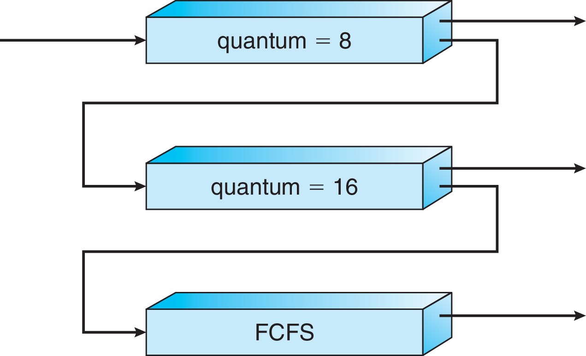

In your groups, answer the following questions.
No need to report the answers to me --
this is just for practice.
There are a lot of questions here,
and I don't necessarily expect us to finish them all.

I will be dropping in and out of rooms to facilitate to the discussions and in
case you have any questions.
Think of it like me walking around the classroom and listening to different
groups.
Again, this isn't meant to be for a grade,
so don't be concerned about giving a wrong answer even if I am in the room.
You can also flag me down in Zoom if you have a question even if I'm not in the
room
(I think the button in Zoom looks like a question mark).

Note: some questions are taken entirely or in part from your textbook.

## General Questions

1. Explain in general terms the difference between preemptive and nonpreemptive
scheduling.

*Note:* When answering the scheduling questions,
you would ideally create a Gantt chart for many of them.
However, that may be difficult to share with your classmates over Zoom
depending on how you do it.

2. How would the following processes be scheduled under SJF scheduling if the
scheduling is
    * nonpreemptive?
    * preemptive?

```
Process   | Arrival Time | Burst Time
---       | ---          | ---
P1        | 0            | 6
P2        | 2            | 5
P3        | 3            | 2
P4        | 4            | 6
```

3. What is the average waiting time in each scenario?

4. Using an exponential average with `a = 0.5`,
fill in the table with the predicted burst times that could be used for SJF.
(This will look similar to the table in the
[slides](https://github.com/bowmnath/cis-452-f20/blob/master/slides/scheduling-bursts.pdf).
Look for the slide with the big graph on it.
The equation on the next slide will also be helpful.)

```
Burst number (i)   | Actual duration (t_i)  | Predicted duration (tau_i)
---                | ---                    | ---
0                  | 5                      | 10
1                  | 5                      |
2                  | 10                     |
3                  | 10                     |
4                  | [unimportant]          |
```

5. Assume a system uses priority scheduling.
The OS has a daemon (A) running that runs once every 5 ms for a duration
of 3 ms.
Another daemon (B) runs once every 5 ms for a duration of 2 ms.
Both daemons have a priority of 1.

A user submits a process of priority 2 with a duration of 3 ms.
How long will it be before the user process gets to run?

What mechanism can we use to allow the user process to run sooner?

6. Four processes arrive in the ready queue at approximately the same time.
Their burst times are given below.
Assuming round-robin scheduling with a time quantum of 4 ms,
what is the turnaround time for each process?

Recall that turnaround time is the entire time from when a process enters the
ready queue to when it finishes running.

```
Process | Burst Time
---     | ---
P1      | 6
P2      | 5
P3      | 2
P4      | 9
```

7. In multilevel queue scheduling,
processes are assigned to queues and those queues are (often) assigned
different priorities.
How is this different from simply using priority scheduling and applying
priorities to the processes directly?

```
Example answer:
There are at least two significant differences between standard priority
scheduling and multilevel queue scheduling.
First, the scheduling between queues can be more flexible.
For example,
with three queues,
the highest-priority queue may get 60% of the available time,
then 30% could go to the next-highest-priority queue,
with the remaining 10% allocated to the lowest-priority queue.
This type of allocation would not be possible with priority scheduling as we
have described it.

Second, each queue can have its own internal scheduling algorithm.
In another three-queue example,
one queue could be round-robin with a small time quantum,
another could be round-robin with a larger time quantum,
and the final queue could be run as SJF.
There is no mechanism to do this with priority scheduling.
```


8. What is the benefit of using a multilevel queue algorithm rather than a
single algorithm for every process on the system?
Give a simple example of a possible multilevel queue setup and why it would be
beneficial.

```
Example answer:
Various processes may have different scheduling needs because we may have
different measures for effective scheduling with various aspects of the
system.
For example, we may want user processes to share time,
but it may be very important that system processes get to run as soon as
possible.

In a very simple setup, we could have two queues:
one for user processes and the other for critical system processes.
The system-process queue would be higher priority and could itself use a
priority-based scheduling algorithm so that the most important process on the
system would always be run immediately.
The second queue would be round-robin.
This way, user processes could share time, and,
if the time quantum were short enough,
we could ensure that there was a low response time,
which is a useful metric to target for interactive user processes.
```

9. Recall the multileve feedback queue from lecture (reproduced below).
Note that, for this particular setup,
there are no arrows from lower-priority to higher-priority queues.
Given the following sets of burst times,
in which queue would each process end up?

* A: 9, 17, 2
* B: 17, 9, 2
* C: 3, 3, 4
* D: 30, 8, 7



```
Answer:
* A: bottom queue
* B: middle queue
* C: top queue
* D: middle queue
```

10. Process A uses a lot of memory.
Process B does not use much memory.
For which one is processor affinity more important?

```
Example answer:
Processor affinity is more important for Process A.
If Process A uses a lot of memory,
it will be more expensive for it to refill the cache when it moves to another
processor and has its cache invalidated.

(Note: this is a bit simplistic.
This assumes that A has an access pattern that makes effective use of cache.
Issues like this are one of the reasons I do not generally release answers to
these questions --
they can stir discussion, but they are sometimes too open-ended to admit a
precise answer without further details.)
```

11. What is the goal of load balancing in multiprocessor scheduling.
How are the goals of load balancing and processor affinity in conflict?

```
Example answer:
Please review the slides or lecture for an introduction to load balancing,
and ask me if there are details that are unclear to you.

Load balancing requires moving processes between CPUs in order to distribute
work evenly.
This is directly in conflict with the goal of respecting processor affinity.
Each time a process is moved between CPUs due to load balancing,
it will have its cache invalidated.
```
