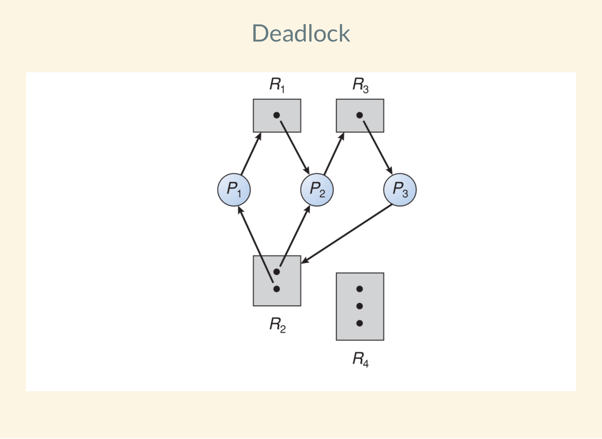

In your groups, answer the following questions.
No need to report the answers to me --
this is just for practice.
There are a lot of questions here,
and I don't necessarily expect us to finish them all.

I will be dropping in and out of rooms to facilitate to the discussions and in
case you have any questions.
Think of it like me walking around the classroom and listening to different
groups.
Again, this isn't meant to be for a grade,
so don't be concerned about giving a wrong answer even if I am in the room.
You can also flag me down in Zoom if you have a question even if I'm not in the
room
(I think the button in Zoom looks like a question mark).

Note: some questions are taken entirely or in part from your textbook.

## General Questions

Notes on code examples:
* Recall from lab this week that for POSIX semaphores,
`sem_wait()` performs a wait and `sem_post()` performs a signal.
* To create semaphores in the code examples I am going to use the non-existant
function `sem_create(sem_t *sem, int value)` that initializes `sem` with a
value of `value`.
This is done so that we do not need to worry about whether the semaphore is
named or unnamed and whether it is shared among threads --
you should be able to tell from context who has access to the semaphore.
Just think of it as our abstract idea of a semaphore.
* As always, the code examples do less error checking than you should.

1. What happens when the following code is run?
```
int a = 5;
sem_t sem;
int main() {
    ...
    sem_create(&sem, 0);
    pthread_create(&tid, NULL, add_num, NULL);
    pthread_create(&tid2, NULL, add_num, NULL);
    pthread_join(tid, NULL);
    pthread_join(tid2, NULL);
    printf("%d\n", a);
    ...

void* add_num(void* inval) {

    sem_wait(&sem);
    a += 5;
    sem_post(&sem);
    return NULL;
}
```

2. Assume that all threads have access to the already-initialized monitor
`SimpleAdd`.
Rewrite the code above so that it is still multithreaded but uses the monitor.

```
monitor SimpleAdd
{
    int a;

    add_value(int b) {
        a += b;
    }

    print_value() {
        printf("%d\n", a);
    }

    initialize() {
        a = 5;
    }
}
```

3. What, if anything, can you do with a monitor that you cannot do with a
semaphore?

4. It is possible for two processes to be "in" the monitor at the same time as
long as only one of them is running.
When can this occur, and why is it helpful?

5. Describe one possible use case for a condition variable.
Considering our classic synchronization problems may be a good place to start.

6. Consider the code below that uses condition variable `cond`.
Describe what the code is trying to do by using condition variables in this
way.

The code will not always perform as expected.
Come up with a scenario in which it will fail.

```
int main() {
    ...
    pthread_create(&tid, NULL, do_setup_work, NULL);
    pthread_create(&tid2, NULL, finish_task, NULL);
    ...

void* do_setup_work(void* in) {
    // do work
    cond.signal()  // <-- condition variable
    return NULL;
}

void* finish_task(void* in) {
    cond.wait()  // <-- condition variable
    // finish work
    return NULL;
}
```

7. If the code above were implemented using a semaphore instead of a condition
variable,
would it always work as expected?
Why or why not?

8. Review the four conditions for deadlock and briefly explain what each one
means.

9. Can deadlock ever occur with just one shared lock?
Why or why not?

10. If process A is waiting for B, B for C, C for D, and D is sleeping while it
waits for a read from the hard disk,
is the system in deadlock?
Why or why not?

11. If the OS requires a process to request all of the resources it will need
at the same time,
will this prevent deadlock from ever occuring?
If so, what is a possible downside?
If not, describe how deadlock could still occur.

12. The following image from your textbook is an example of deadlock.



Find a single arrow that, if removed, will get rid of the deadlock.
Then, try to determine all such arrows.

13. Modern operating systems often solve the issue of deadlock by ignoring it
entirely.
Give some pros and cons of this strategy.
